<h1  align ="center"><B><font size="100" color="black">XVision软件技术开发文档</font></B></h1>

| 版本 | 修订日期  | 编写/整理 | 更新内容 |
| ---- | --------- | --------- | -------- |
| V1.0 | 2022.5.24 | 谢易      | 初版     |


[toc]

# **1.引言**

## 1.1 背景

​			本项目XVision软件开发意图为实现对Halcon、Opencv算子及其它视觉软件的便捷使用，由于Halcon和Opencv使用相比VisionPro较为麻烦，故此本软件仿照海康VisionMaster的流程图式操作，实现对Halcon、Opencv及其它视觉软件的二次开发。


## 1.2 编写目的

​		  本文档编写目的是系统性介绍XVision软件的编程架构和设计思路，为后续软件维护和开发打下基础。


## 1.3 术语定义

| 术语名称           | 术语解释                                                     |
| ------------------ | :----------------------------------------------------------- |
| 算子(Func)         | 一种视觉/数据处理方法，实现图像或者数据处理功能(可理解为编程中的函数) |
| 流程(Flow)         | 算子合集，实现算子的组合运算，重合实现复杂功能。流程分为主流程和子流程两种 |
| 项目(Project)      | 流程合集，实现流程的策略化运行；同时包含全局数据和算子、全局脚本等运行相关数据 |
| X对象(XObject)     | 用于算子之间交互的通用数据，实现数据在不同算子之间进行传递   |
| 消息命令(TokenMsg) | 一种用来传递命令的机制，发送者可以发送消息让接收者执行对应操作(可理解为TCP/IP协议) |


# 2.系统概述

## 2.1 软件概述

* 本软件使用Qt框架进行开发，实现对视觉流程的自由搭配，市场上对标海康威视的VisionMaster；

* 本软件使用插件化开发框架，可使用提供的二次开发库自行添加新功能算子和新模块(将生成的插件放置到对应目录下即可)；

  

## 2.2 功能概述:

* **视觉流程图式编程**:实现对视觉/数据处理算子的自由编程，从而实现各类复杂的视觉需求

* **项目读取保存**:将编程的视觉项目进行保存或者读取

* **图像显示**:主界面中可以显示及监控视觉算子的图像处理情况

* **日志消息显示**:显示软件运行过程中出现的日志消息

* **多语言**:可进行多种语言切换

  

## 2.3 开发平台

* **主开发语言:**Qt(C++)

* **C++语言标椎:**C++17

* **开发环境:**Window/Linux(未实现)

* **编程平台:**Qt Creator

* **编译器:**

   | 编译器 | 版本                    |
   | ------ | ----------------------- |
   | MSVC   | Qt 6.4.0 MSVC2019 64bit |
   | Mingw  | Qt 6.4.0 MinGW 64-bit   |

* **视觉工具**:Halcon19.11 Progress X64

   
  
  

# 3.框架结构

## 3.1 工程整体框架

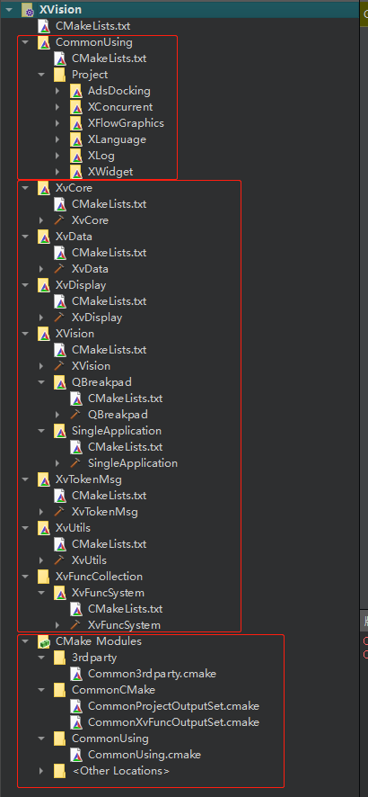

<center style="color:#C0C0C0;text-decoration:underline">图3.1.1 工程目录</center>

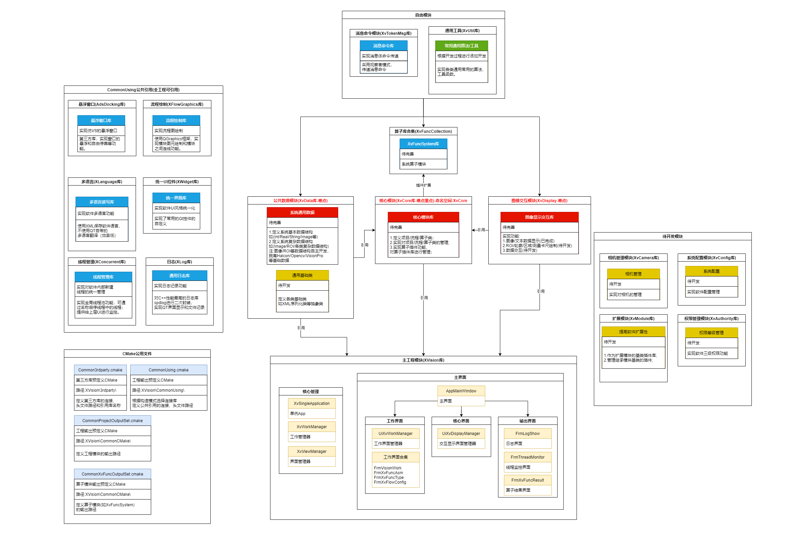

<center style="color:#C0C0C0;text-decoration:underline">图3.1.2 工程架构</center>

​		XVision软件主要有13个项目工程和4份工程配置文件构成(如图3.1.1和3.1.2所示)，后续需要根据需求进行扩展添加新的工程。其中XVision为主工程模块，XvCore/XvData/XvDisplay为重要核心模块工程，XvFuncCollection目录为算子实现工程(所有算子实现都放置到该目录下)，其他工程为辅助模块工程。


## 3.2系统分层

### 3.2.1 分层概述

​			当前对工程架构进行了分层，总共有三个层级，分别为主工程层、核心工程层和辅助工程层。下述对这三个层级进行详解。

### 3.2.2 主工程层

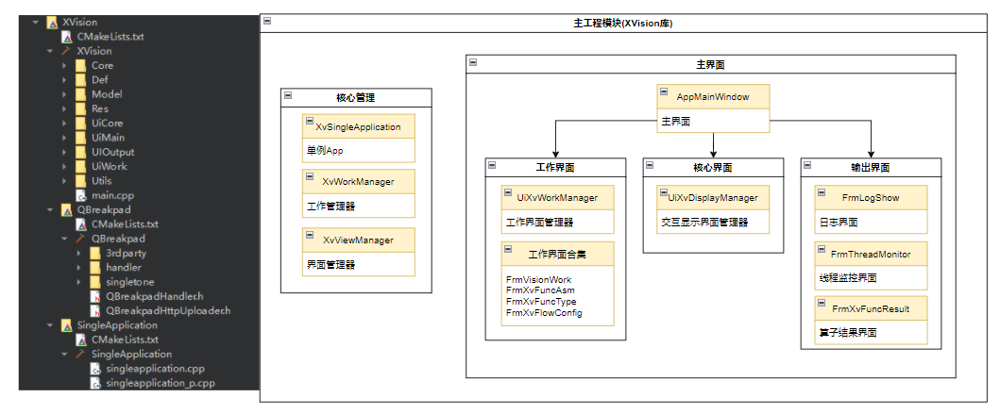

<center style="color:#C0C0C0;text-decoration:underline">图3.2.2 主工程层</center>

​		主工程层结构如上图3.2.2所示，XVision为软件的可执行程序工程，该工程下包含QBreakpad(软件崩溃记录库)和SingleApplication(单例APP库)这两个库，以及软件主要界面窗口类。在开发逻辑中该层通过界面与底层核心工程模块进行数据交互。

### 3.2.3 核心工程层

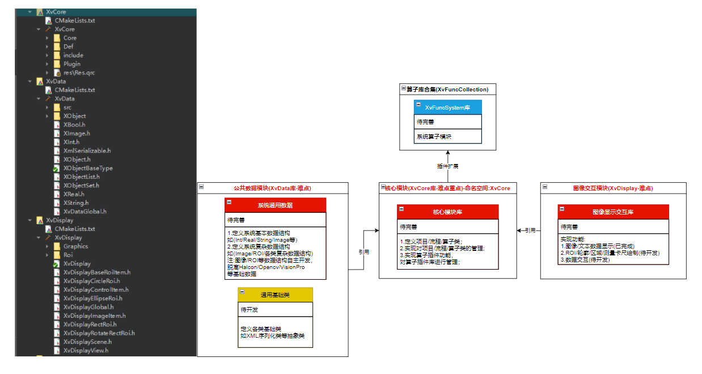

<center style="color:#C0C0C0;text-decoration:underline">图3.2.3 核心工程层</center>		

核心工程层结构如上图3.2.3所示，共有四个工程分别为XvCore核心库、XvData公共数据库、XvDisplay图像交互库及继承于XvCore库的XvFuncSystem系统算子库。XvCore库为软件的核心模块，所有的开发逻辑都围绕着该库进行；XvData库为软件的公共数据库，定义开发中遇到的数据类型和类等；XvDisplay库实现用户和图像的交互功能，例如图像及图中文本显示、Roi绘制等功能。XvFuncSystem库为继承于XvCore的算子插件库，封装了常用的图像和数据处理算子。

### 3.2.4 辅助工程层

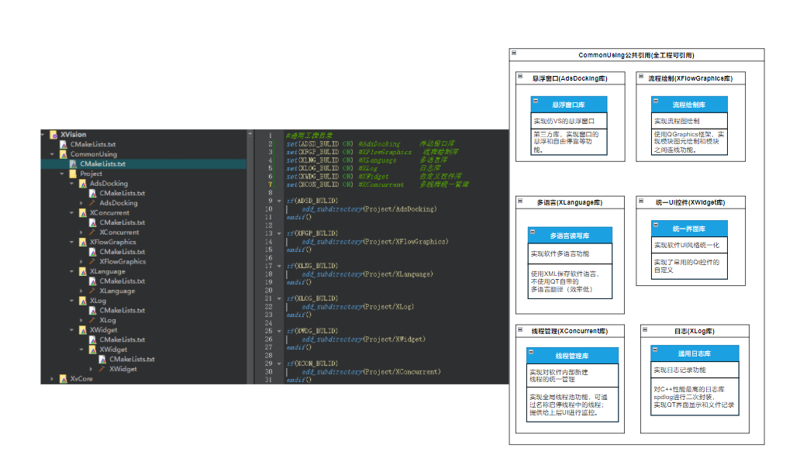

<center style="color:#C0C0C0;text-decoration:underline">图3.2.4 辅助工程层</center>				

辅助工程层结构如上图3.2.4所示，共有6个工程分别为AdsDocking悬浮窗口库、XFlowGraphics流程绘制库、XLanguage多语言库、XWidget统一UI库、XConcurrent线程管理库和XLog日志库。

​		该层在开发逻辑中作为“第三方库”进行调用，每个工程都不存在其他工程依赖，全工程都可以引用。该层较少开发，只需要在第一次编译工程的时候，使用图中CMakeLists加载该层所有库进行编译(如图所示使用"ON"加载工程)，编译完成后会将动态库的生成在XVision\CommonUsing\Lib(Release模式)或者XVision\CommonUsing\LibD(Debug模式)目录中供其他层级的工程调用。生成库后便可以使用"OFF"卸载工程，减少整体编译时间。


## 3.3 模块详解

### 3.3.1 XVision

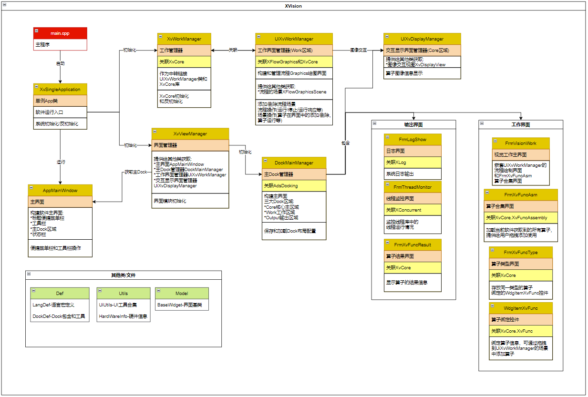

<center style="color:#C0C0C0;text-decoration:underline">图3.3.1 XVision工程</center>				

### 3.3.2 XvCore

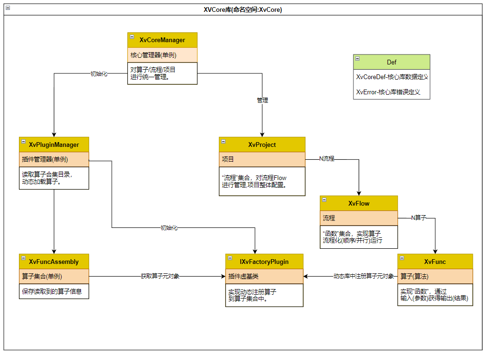

<center style="color:#C0C0C0;text-decoration:underline">图3.3.2 XvCore工程</center>				

### 3.3.3 XvData

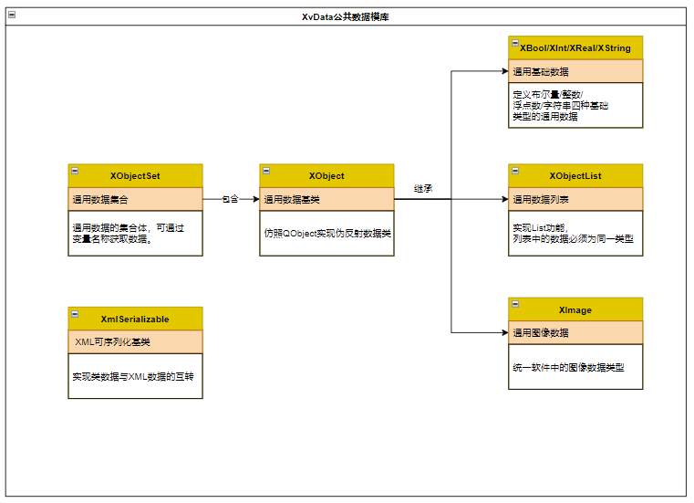

<center style="color:#C0C0C0;text-decoration:underline">图3.3.3 XvData工程</center>				

### 3.3.4 XvDisplay

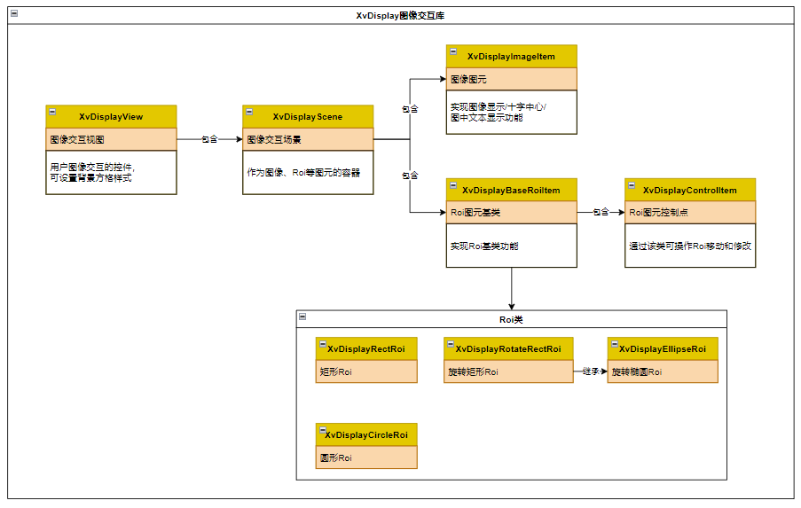

<center style="color:#C0C0C0;text-decoration:underline">图3.3.4 XvDisplay工程</center>				

### 3.3.5 XvTokenMsg

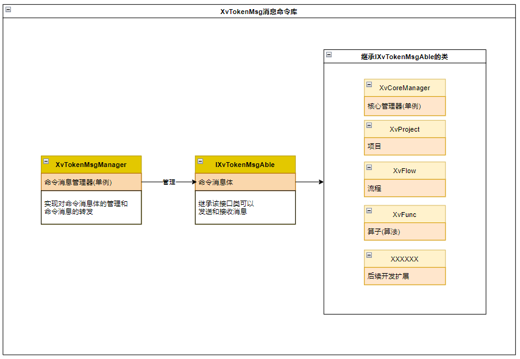

<center style="color:#C0C0C0;text-decoration:underline">图3.3.5 XvTokenMsg工程</center>				


# **4.核心类详解**

## 4.1 算子基类XvFunc

**基本属性**


| 属性名   | 类型        | 描述                                          |
| :------- | ----------- | --------------------------------------------- |
| funcId   | QString     | 算子唯一ID号(算子的UID,不可重复)              |
| funcRole | QString     | 算子功能标识符(在开发层面上必须唯一,不可重复) |
| funcType | EXvFuncType | 算子类型(枚举)                                |
| funcName | QString     | 算子名称                                      |

**算子状态**

| 状态名称   | 类型             | 描述                                         |
| ---------- | ---------------- | -------------------------------------------- |
| runStatus  | EXvFuncRunStatus | 算子运行结果(初始化/正在运行/成功/失败/错误) |
| runMsg     | QString          | 算子运行信息                                 |
| runElapsed | double           | 算子运行耗时                                 |

**算子数据**

| 数据名称          | 类型                        | 描述             |
| ----------------- | --------------------------- | ---------------- |
| lstFatherFunc     | QList<XvFunc*>              | 父连接算子列表   |
| lstSonFunc        | QList<XvFunc*>              | 子连接算子列表   |
| mapParamSubscribe | QMap<QString,SubscribeInfo> | 参数订阅连接映射 |

**接口详情**

| 接口名称         | 参数                                                         | 返回             | 功能               |
| ---------------- | ------------------------------------------------------------ | ---------------- | ------------------ |
| getParam         | 无                                                           | XvBaseParam*     | 获取算子输入参数   |
| getResult        | 无                                                           | XvBaseResult*    | 获取算子输出结果   |
| updataParam      | const QString &paramName,XObject* object                     | bool             | 更新参数           |
| paramSubscribe   | const QString &paramName,XvFunc* target,const QString &resultName | bool             | 参数进行订阅       |
| paramUnSubscribe | const QString &paramName                                     | bool             | 参数取消订阅       |
| runXvFunc        | 无                                                           | EXvFuncRunStatus | 算子运行接口(外部) |
| run              | 无                                                           | EXvFuncRunStatus | 算子运行接口(内部) |
| onShowFunc       | 无                                                           | 无               | 算子显示界面       |


## 4.2 流程类XvFlow

**基本属性**


| 属性名   | 类型    | 描述                             |
| :------- | ------- | -------------------------------- |
| flowId   | QString | 流程唯一ID号(算子的UID,不可重复) |
| flowName | QString | 流程名称                         |

**流程状态**

| 状态名称     | 类型             | 描述                                         |
| ------------ | ---------------- | -------------------------------------------- |
| runStatus    | EXvFlowRunStatus | 流程运行结果(初始化/正在运行/成功/失败/错误) |
| runCode      | RetXv(int)       | 运行代码                                     |
| runMsg       | QString          | 流程运行信息                                 |
| runElapsed   | double           | 流程运行耗时                                 |
| lastErrorMsg | QString          | 最后错误信息                                 |

**流程数据**

| 数据名称   | 类型                  | 描述         |
| ---------- | --------------------- | ------------ |
| mapFunc    | QMap<QString,XvFunc*> | 算子字典     |
| runThread  | XThread               | 流程运行线程 |
| flowConfig | XvFlowConfig          | 流程配置     |

**接口详情**

| 接口名称     | 参数                | 返回       | 功能               |
| ------------ | ------------------- | ---------- | ------------------ |
| runOnce      | 无                  | RetXv(int) | 流程单次运行       |
| runLoop      | 无                  | RetXv(int) | 流程循环运行       |
| stop         | 无                  | RetXv(int) | 流程停止运行       |
| wait         | unsigned long ms=0  | RetXv(int) | 等待流程运行结束   |
| createXvFunc | const QString &role | XvFunc*    | 通过标识符创建算子 |
| removeXvFunc | const QString &id   | bool       | 通过ID移除算子     |


## 4.3 项目类XvProject

**基本属性**


| 属性名      | 类型    | 描述                             |
| :---------- | ------- | -------------------------------- |
| projectId   | QString | 项目唯一ID号(算子的UID,不可重复) |
| projectName | QString | 项目名称                         |

**接口详情**

| 接口名称      | 参数                       | 返回    | 功能                 |
| ------------- | -------------------------- | ------- | -------------------- |
| createXvFlow  | const QString &name="Flow" | XvFlow* | 创建流程             |
| removeXvFlow  | const QString &id          | bool    | 通过ID移除流程       |
| removeXvFlows | const QString &name        | int     | 通过名称移除多个流程 |


## 4.4 核心管理器XvCoreManager

**接口详情**

| 接口名称      | 参数                | 返回       | 功能             |
| ------------- | ------------------- | ---------- | ---------------- |
| init          | 无                  | bool       | 初始化           |
| uninit        | 无                  | bool       | 反初始化         |
| getXvProject  | 无                  | XvProject* | 获取全局唯一项目 |
| loadXvProject | const QString &path | bool       | 加载项目         |
| saveXvProject | const QString &path | bool       | 保存项目         |


# **5.界面布局**

## 5.1 主界面展示

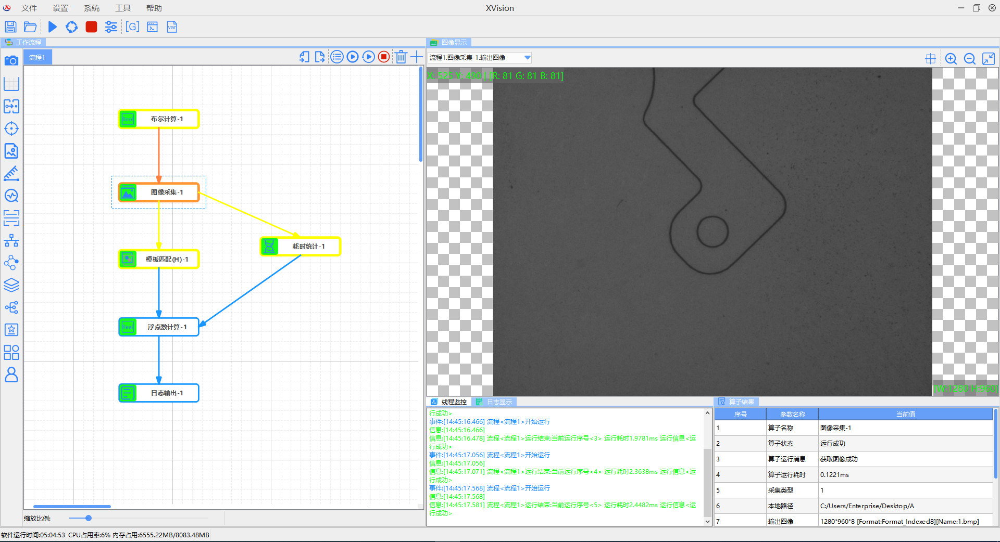

<center style="color:#C0C0C0;text-decoration:underline">图5.1.1 主界面</center>		


主界面共分为5个区域:

* **菜单及工具栏:**标题处菜单栏及最上方的工具栏；
* **工作Dock区:**算子列表和流程绘制区域；
* **核心Dock区:**图像显示和数据交互区域；
* **输出Dock区:**日志/线程监控/算子结果显示区域；
* **状态栏:**底部软件运行状态信息显示区。

## 5.2 主界面各模块介绍

### 5.2.1 菜单及工具栏


<center style="color:#C0C0C0;text-decoration:underline">图5.2.1 菜单及工具栏</center>		

* **菜单栏**
  * 文件:对项目文件进行操作
  * 设置:软件设置和项目配置
  * 系统:日志查看、相机管理等功能
  * 工具:标定工具和标定模板生成等功能
  * 帮助:语言选择、帮助文档等


* **工具栏**
  * 保存项目:将当前项目保存到文件中
  * 打开项目:加载文件中的项目
  * 单次运行项目:运行一次项目
  * 循环运行项目:重复运行项目
  * 停止项目运行:停止当前运行的项目
  * 项目配置:打开项目配置界面
  * 全局管理:对全局数据和全局算子进行管理
  * 全局脚本:打开脚本编辑和操作界面
  * 变量管理:对当前所有算子的输入参数和输出结果的变量进行监控


### 5.2.2 工作Dock区

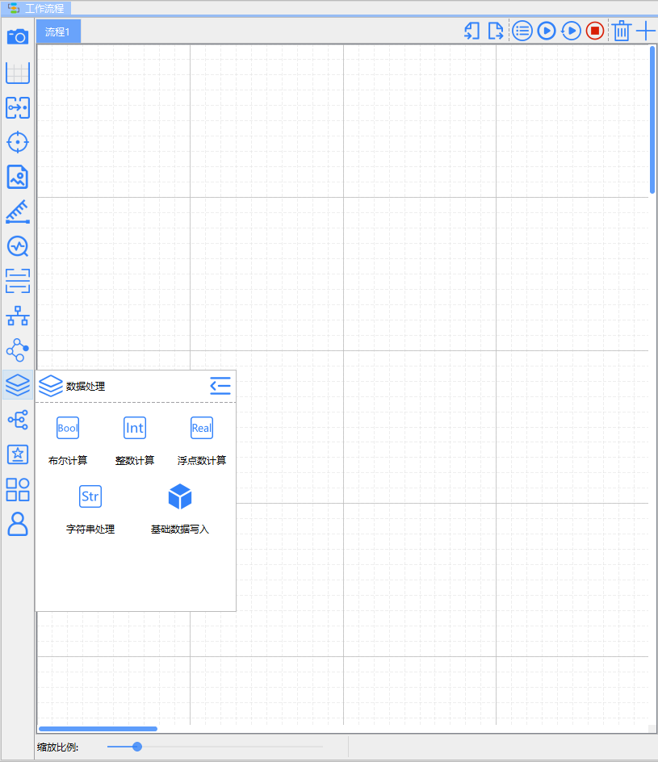

<center style="color:#C0C0C0;text-decoration:underline">图5.2.2 工作Dock区</center>		


​		该区域包含算子列表和流程绘制区域，点击左侧算子类型合集按钮，可呼出算子进行拖动添加操作。在此界面中可添加流程和算子，实现拖拽式视觉编程。

### 5.2.3 核心Dock区

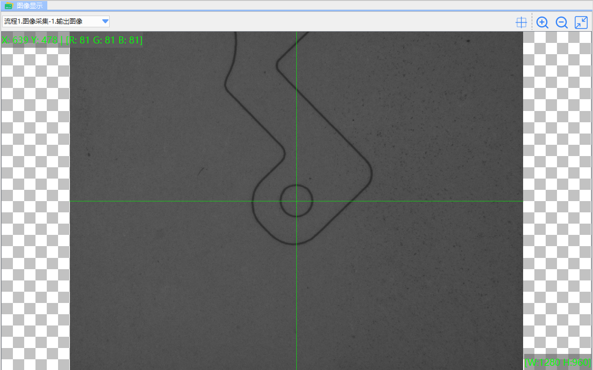

<center style="color:#C0C0C0;text-decoration:underline">图5.2.3 核心Dock区</center>		

​		该区域为图像和数据交互区，实现算子中图像的显示以及Roi等数据的交互。移动鼠标可以获取图像的RGB值和坐标。

### 5.2.4 输出Dock区

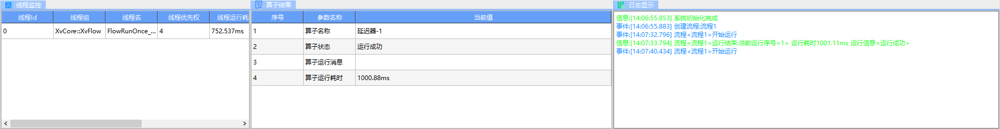

<center style="color:#C0C0C0;text-decoration:underline">图5.2.4 输出Dock区</center>		

​	该区域为软件信息的监控和输出区，共有三个子区域:

* 日志显示:显示软件日志的信息；

* 算子结果:显示算子的输出结果内容；

* 线程监控:显示软件统一线程池中的线程状态；

  

### 5.2.5 状态栏


​		该区域为软件的系统状态栏，显示软件整体运行情况。

# **6.开发注意事项**

* Debug/Release切换:切换构建模式时，需要同步修改XVision\CommonUsing\CommonUsing.cmake中的"set(CurBuildType_IsDebug ON/OFF)"，Debug模式为ON，Release为OFF，防止引用dll库错误；

* 生成路径:所有主要工程都需要在CMake中添加"include (../CommonCMake/CommonProjectOutputSet.cmake)"，使之能生成在同一个目录中。注:当前XVision/XvCore/XvData/XvDisplay/XvUtils/XvTokenMsg已经添加无需重复添加；

* 调用CommonUsing库:需要调用CommonUsing中的库时，需要在CMake中添加"include (../CommonUsing/CommonUsing.cmake)"，具体可参考XvCore工程中CMake的用法；

* 维护XWidget:当在开发中需要根据需求修改XWidget库(XVision\CommonUsing\Project\XWidget)，需要同步更新Gitlab上的XWidget库，保持两个工程的同步，并记录在XVision\CommonUsing\Project\XWidget\更新XWidget库注意事项.txt中；

* Halcon等第三方库引用:当算子插件dll使用Halcon之类的第三方库，dll生成时是不会自动将Halcon生成到exe目录中的，继而引起exe无法加载插件的错误，故此需要在引用Halcon等第三方库的工程CMake添加以下代码，使之可以自动复制第三方库到exe目录中(可参考XvFuncSystem工程的CMake);

  ```cmake
  #此处需要将引用的halcon库复制到exe目录中，否则插件系统无法加载本dll
  add_custom_command(TARGET ${PROJECT_NAME} POST_BUILD
      COMMAND ${CMAKE_COMMAND} -E copy_if_different
          ${CMAKE_CURRENT_SOURCE_DIR}/${库路径}/第三方库.dll
          ${CMAKE_CURRENT_SOURCE_DIR}/${库路径}/第三方库.lib
          $<TARGET_FILE_DIR:${PROJECT_NAME}>
  )
  ```

  

