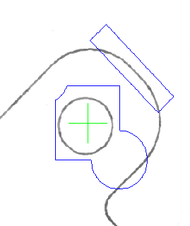

<h1  align ="center"><B><font size="100" color="black">XVision后续开发工作</font></B></h1>

| 版本 | 修订日期  | 编写/整理 | 更新内容         |
| ---- | --------- | --------- | ---------------- |
| V1.0 | 2023.5.19 | 谢易      | 后续开发工作整理 |


[TOC]


# 1.评估及整体概述

## 1.1 评估

### 1.1.1 优度

* **Y3**:优先度最高,亟待完成;
* **Y2**:优先度中等,可延后完成;
* **Y1**:优先度最低;

### 1.1.2 难度

* **N3**:困难,需要对整体软件框架有所了解,并具备较高C++/QT编程水平,开发时间较长;

* **N2**:较难,熟悉当前模块结构及函数调用,开发时间中等;

* **N1**:普通,了解当前类功能即可;


### 1.1.3 重要性评估

* 重要性权值:Z=Y\*0.6+N\*0.4 Eg:Z(Y2,N3)=2\*0.6+3\*0.4=2.4

## 2.整体概述


# 2.XvData数据模块

## 2.1 Roi中间数据类簇(Y2,N3)

**目的:**

​	 该类簇功能是作为各类视觉库(Halcon/Opencv/VisionPro/或者自研)与XvDisplay模块的Roi图元进行数据对接，同时统一和兼容各类视觉库的Roi数据(各视觉库可互相转换Roi)，并可通过XObject类进行算子之间的Roi数据交互。

**开发思路:**

​		1.新建Roi基类(**XRoiBase**)，实现基础的Roi属性(如名称/类型等);

​		2.继承Roi基类实现多种Roi数据类(Eg:**XRoiRect/XRoiCircle/XRoiRectR/...**);

​		3.Roi合集类(**XRoiSet**):该类为实现Roi并集和差集功能,用来描述多种Roi合并的关系(参考Halcon的union2和difference接口)，建议同继承于XRoiBase，在该类中提供一个**[XRoiPath* getRoiPath() const]**接口获取Roi描述路径供上层界面显示，并使用**[QMap\<XRoiBase*,PathType\>]**容器来保存当前的Roi集合，其中**PathType**为枚举，表述该Roi是并集还是差集。

​		4.Roi路径描述类(**XRoiPath**):描述Roi的路径，可借鉴.svg可缩放矢量图形中描述路径的方法。


## 2.2 模板特征轮廓描述类(Y2,N3)

**目的:**

​		该类功能为描述图像匹配中的特征轮廓，统一和兼容各类视觉库轮廓数据，实现轮廓数据互转。

**开发思路:**

​		1.新建轮廓类(**XContour**)，实现对底层视觉库特征轮廓的抽象描述；

​		2.轮廓本质是点Point或者路径Path的集合，可参考2.1中**XRoiPath**的开发思路，另外需要考虑该类的性能，在特征较多的情况下保证显示或者转换的运行效率(采用哈希表？)。


## 2.3 图像区域描述类(Y2,N3)

**目的:**

​		该类功能为实现对图像涂抹功能(掩膜)的区域描述，统一和兼容各类视觉库区域数据，实现区域数据互转；

​		可借鉴Halcon的paint_region。

**开发思路:**

​		1.新建区域类(**XRegion**)，实现对底层视觉库掩膜的抽象描述；

​		2.使用Path来描述该区域位置(同2.2)。


## 2.4 测量卡尺数据类簇(Y2,N3)

**目的:**

​		该类为实现对测量卡尺功能的卡尺数据描述，统一和兼容各类视觉库卡尺数据，实现卡尺数据互转；

**开发思路:**

​	1.新建卡尺基类(**XMetrologyBase**)，保存测量卡尺基础属性，提供转换为子类的接口；

​	2.继承卡尺基类实现多种卡尺数据类(Eg:**XMetrologyLine/XMetrologyRect/XMetrologyCircle/...**)，此处可参考Halcon的add_metrology_object\_\*\*\*\*\*_measure接口，根据需求创建对应的卡尺类型，常规为线条卡尺，圆形卡尺等;

​	3.该类簇思路基本和Roi一致，但需要在该类中包含测量卡尺的视觉信息，如卡尺条数，卡尺尺寸，极性及阈值等(设计图像处理相关信息，可参考VisionPro和Halcon的卡尺信息)。


## 2.5 XObject类簇扩展(Y3,N1)

**目的:**

​		该类簇已经实现常用的数据结构，如四种基础数据bool/int/double(real)/string，及图像类XImage(该类后续需要优化，见2.6)。本类簇作用于算子之间的数据交互，实现算子的参数和结果的绑定获取。

**开发思路:**

​			1.扩展XObject类簇需要先继承XObject类;

​			2.新增点描述类对象(**XPoint2D**,**XPoint3D**)，**XPoint2D**类包含2维坐标[double valueX,double valueY]，**XPoint3D**类包含3维坐标[double valueX,double valueY,double valueZ];

​			3.新增Roi描述类对象(**XRoiObject**)，该类为2.1中**XRoiSet**类的映射，用于不同算子之间交互Roi数据，直接添加变量[XRoiSet value]即可；

​			4.新增轮廓描述类对象(**XContourObject**)，该类为2.2中**XContour**类的映射，用于不同算子之间交互轮廓数据，直接添加变量[XContour value]即可；

​			5.新增区域描述类对象(**XRegionObject**)，该类为2.3中**XRegion**类的映射，用于不同算子之间交互区域数据，直接添加变量[XRegion value]即可；

​			6.新增卡尺描述类对象(**XMetrologyObject**)，该类为2.4中**XMetrologyBase**类的映射，用于不同算子之间交互卡尺数据，直接添加变量[XMetrologyBase value]即可；

​		   7.新增形状描述类对象(**XLine**,**XRect**,**XCircle**....),该类集对形状进行描述，例如**XLine**线类包含线的起始和结束坐标[XPoint2D valueStart,XPoint2D valueEnd]，**XCircle**圆类包含圆的圆心坐标和半径[XPoint2D valuePos,XReal valueRadius]等；


​		注:后续需要根据开发情况，引入对应的XObject子类。


## 2.6 XImage类优化(Y1,N3)

**目的:**

​		该类为不同算子之间交互图像数据，目前临时使用QImage作为成员变量value，考虑到效率原因，后续需要根据开发情况和能力进行优化。

**开发思路:**

​		1.建议重新封装一个图像类，可以通过该类转换为各类视觉库用的图像类(该开发难度较大)，并将原先的QImage换成该类，同时需要修改与XvDisplay与之相关的显示图像操作(例如:XVision::UiXvDisplayManager::onUpdateXvFuncDisplay接口)。

​		2.QImage转换为HObject的效率较低，如考虑开发周期较短和人员欠缺，将QImage替换为HObject即可，同时需要同步将软件视觉库都修改为Halcon(不太推荐)。

​	

## 2.7 注意事项

​		2.1、2.2和2.3开发起来较为困难，需要研究图形学相关知识。


# 3.XvCore核心模块

## 3.1 项目XvProject的加载及保存(Y3,N2)

**目的:**

​		该功能为实现项目(包含流程/算子/配置)的加载和保存，实现项目本地永久化存储。

**开发思路:**

* XML序列化(建议)

​		1.由于 C++没有原生的XML序列化库，可将**XvProject/XvFlow/XvFunc**等类继承**XvData.XmlSerializable**，实现类数据和XML数据的互相转换(需要实现接口，参考下表)；

​		2.各类Xml互转参考:

| **类**        | **接口:toXmlElement(将数据转换为Xml节点)/接口:fromXmlElement(从Xml节点转换为数据)** |
| ------------- | ------------------------------------------------------------ |
| **XvProject** | 1.项目属性；2.流程字典(**mapFlow**)；3.项目配置(运行策略)；4.全局数据及算子管理器**XvGlobalManager**；5.全局脚本**XvGlobalScript** |
| **XvFlow**    | 1.流程属性；2.算子字典(**mapFunc**)；3.流程配置；            |
| **XvFunc**    | 基类实现:<br />1.算子属性；2.算子参数(输入)和结果(输出)(非空保存读取)；3.参数绑定列表(**_mapParamSubscribe**)；<br />2.子类实现:<br />1.算子其他数据存取(参数和结果外的数据) |

​		3.考虑到需要保存图像/Roi/区域等数据，可以考虑将此类数据转换为二进制文本数据保存到XML文本中。

* 二进制序列化(不建议)

  参考QByteArray，此处不做赘述。
  
  

## 3.2 流程XvFlow的导入及导出(Y3,N1)

**目的:**

​		该功能为实现流程数据的加载和保存，使项目可以从外部导入其他项目的流程，或者将本项目的某个流程进行导出，供其他项目调用，实现对流程便捷存取。

**开发思路:** 

​		参考3.1中的读取保存方法，复用**XvFlow**类的读取保存接口即可。


## 3.3  XvProject类项目配置(运行策略)规划及开发(Y3,N2)

**目的:**

   *   实现多流程情况下的运行顺序，使能流程顺序/并行/子流程化运行;
   *   实现项目其他方面的配置。

**开发思路:** 

​	1.新建项目配置类**XvProjectConfig**类；

​	2.流程顺序/异步/子流程化运行:

   * 默认第一个创建的流程为主流程，其他流程为子流程，可通过项目配置将流程设置为主/子流程；

   * 运行策略有两种:顺序执行和并行执行，顺序执行时按照主流程排列的顺序进行执行，并行执行时则同时执行所有主流程；

   * 子流程化:子流程无法被项目主动调用运行，需要被其他主流程调用才可以运行，可开发一个子流程运行算子，该算子绑定一个子流程，当该算子运行时候调用绑定的子流程进行运行。

     

     如上图所示，主流程中，可以使用子流程算子用并行或者顺序(阻塞，需等待子流程运行结束)执行设置的子流程。
     
     

## 3.4 XvProject类项目执行功能开发(Y3,N1)

**目的:**

​		实现项目的单次执行，重复执行和停止功能。

**开发思路:** 

​	   该功能需要以3.3实现为前提，参考**XvFlow**类的执行函数，对应实现**XvProject**的**runOnce/runLoop/stop/wait**等函数即可。


## 3.5 XvFlow类流程执行结构优化(Y3,N3)

**目的:**

​		当前**XvFlow**类的流程执行结构相对简单，只是简单使用图的广度遍历算法(BFS)运行，本质上还是顺序执行，后续建议进行优化。

**需求及开发思路:** 

  * 实现算子并行运行:

    

    

    如上图所示，在红框范围内的**[并行执行算子]**都为同步运行，使用**[并行执行块开始算子]**和**[并行执行块结束算子]**和其他算子作为区分，在这两个算子范围内的算子，同一树层级的算子都同步执行，该树层中所有算子运行完毕后再执行下一层的算子。

    

  * 实现分支判断运行:

    

    如上图所示，在红框范围内为分支判断执行块，流程根据**[分支判断算子]**的结果执行下方同一树层中对应的算子，该树层执行完毕后方可执行下一树层的算子。该功能的开发重点应该放在**[分支判断算子]**中，在该算子中判断祖先算子的结果，根据判断结果返回给流程需要执行的子算子，返回结果可以单个算子也可多个，从而实现分支执行的功能。

* 实现循环块运行:


​		如上托所示，在红框范围内为循环块，在该块中循环执行块中的算子，**[循环块开始算子]**兼顾判断功能，根据输入参数判断是否满足循环条件，不满足则将下一个运行算子跳到**[循环块结束算子]**结束循环。


**注:**以上运行功能需要开发对应的算子并且在**XvFlow::_threadRun**接口中做优化修改，该功能较难开发。


## 3.6 新增XvGlobalManager 全局数据及算子管理类(Y1,N1)

**目的:**

​		该功能为实现项目中全局数据和全局算子的管理，所有流程和算子都可以从该类中拿到数据和算子，并对之进行操作。

**开发思路:** 

​		1.新建全局管理**XvGlobalManager**类；

​		2.类中添加[**QList<XObject*> _lstGlobalData**]全局数据列表，添加[**QList<XvFunc*> _lstGlobalFunc**]全局算子列表作为成员变量；

​		3.新增添加、删除和获取全局数据/算子接口，以便所有算子流程都可对其操作。


## 3.7 新增XvGlobalScript全局脚本功能(Y1,N3+)

**目的:**

​		该功能为实现较为简单的脚本功能，可根据脚本内容，对流程运行、算子数据进行操作。后续如有添加通讯功能，可以通过该脚本进行发送接收等操作。

**开发思路:** 

​		1.新建全局脚本**XvGlobalScript**类；

​		2.设置脚本运行时机，可在3.3项目配置中进行设置；

​		3.由于当前软件使用C++作为编程语言，但C++作为脚本语言较为困难，建议采用其他语言作为脚本语言(如python,lua)等，并为该类语言提供C++接口，以便调用软件数据；

​		4.需要内置脚本语言编译库，对脚本语言进行编译。


## 3.8  XvFlow类配置XvFlowConfig类扩展 (Y1,N1)

**目的及开发思路 :**

​		该功能为设置流程运行的相关参数，如算子错误跳出运行，运算间隔等，后续根据需求扩展并同步将配置实现在对应函数中即可。


## 3.9 XvFunc算子类XvDisplayView关联(Y1,N2)

**目的:**

​		该功能是将算子图像处理相关信息显示在主界面的XvDisplayView控件中，如匹配位置点、匹配分数、轮廓特征、卡尺信息等。

**开发思路:**

​		1.**XvCoreManager**核心管理器类中创建成员变量**XvDisplayView**指针,软件主界面加载时将UiXvDisplayManager::displayView关联到该指针；

​		2.算子需要用到**XvDisplayView**时，使用如下代码即可。

```c++
#include "XvCoreManager.h"
void run()
{
    auto view=XvCoreMgr->getDisplayView();
    view->dosometing();
    auto scene=view->getgetScene();
    scene->dosometing();
}
```


# 4.XvDisplay图像交互模块

## 4.1 XvDisplay\*\*\*\*RoiItem Roi图元类簇扩展(Y2,N3)

**需求:**

​		目前XvDisplay\*\*\*\*RoiItem已经实现了矩形(Rect)/旋转矩形(RotateRect)/圆形(Circle)/椭圆(Ellipse)四种Roi，后续需要根据需求对其进行扩展，并且还需开发一个Roi集合类(**XvDisplayRoiSetItem**)对Roi并集差集进行描述。

**关联:**

​		2.1 Roi中间数据类簇(Y2,N3)

**开发思路:**

​		1.对Roi图元和Roi中间数据类进行绑定:在Roi图元类中添加对应的Roi中间数据类(eg:**XvDisplayRectRoi**类中添加**XRoiRect**)，实现数据-界面显示-数据的互相转换；

​		2.实现Roi合集类**XvDisplayRoiSetItem**,绑定**XRoiSet**类，但绘制Roi时根据设置的并集或者差集对Roi合集进行修改，实现多种多个Roi图元的交叉合集，该类可以使用QPainterPath进行显示，但要确保显示的精度及从**XRoiSet**转换为QPainterPath的效率。



​		如上图所示，蓝色图元为Roi合集，该Roi合集为一个矩形、一个圆形、一个旋转矩形构成的合集和一个差集圆形组成，可用**XvDisplayRoiSetItem**实现该Roi合集。


## 4.2 XvDisplayContourItem特征轮廓图元类(Y2,N3)

**需求:**

​		该类为实现模板轮廓在QGraphics框架中的显示

**关联:**

​		2.2 模板特征轮廓描述类(Y2,N3)

**开发思路:**

​		1.对轮廓图元和轮廓描述类进行绑定:在**XvDisplayContourItem**轮廓图元类中添加**XContour**轮廓描述类，实现数据-界面显示-数据的互相转换；

​		2.目前显示方面没有什么较好的实现方法，但可以从以下两个方向考虑：

​			a.使用QPainterPath绘制轮廓点线面，但该方法可能比较耗费时间和内存，在模板轮廓较大和较多的情况下可能不太理想；

​			b.将模板轮廓转换为位图数据，直接显示在对应位置中，该方法较为简单粗暴，但还需考虑转换时的效率问题。


## 4.3 XvDisplayRegionItem图像区域图元类及涂抹功能(Y2,N3)

**需求:**

​		该功能为实现涂抹掩膜功能，及其在QGraphics框架中的显示。

​		涂抹功能:实现类似VisionPro/Halcon制作模板时的掩膜功能，如下图所示，图中黄色区域为涂抹的掩膜区域，模板制作只对当前掩膜区域的特征进行识别。

​																		

​		

**关联:**

​		2.3 图像区域描述类(Y2,N3)

**开发思路:**

* **XvDisplayRegionItem**:

  ​		1.对区域图元和区域描述类进行绑定:在**XvDisplayRegionItem**区域图元类中添加**XRegion**区域描述类，实现数据-界面显示-数据的互相转换；

  ​		2.该类思路可参考4.1，同样采用QPainterPath进行显示；

* **涂抹功能**:

  ​		1.该功能目前在QT上还是较好实现的，但要考虑如何将涂抹后的图元转换为**XvDisplayRegionItem**及绑定的**XRegion**；

  ​		2.实现思路可参考https://blog.csdn.net/hw5230/article/details/128211303，将画笔扩大即可。

  

## 4.4 XvDisplayMetrologyItem测量卡尺图元类簇(Y2,N3)

**需求:**

​		该功能为实现卡尺类在QGraphics框架中的显示，如下图所示，下图显示了Halcon中的直线卡尺和圆形卡尺。


**关联:**

​		2.4 测量卡尺数据类簇(Y2,N3)

**开发思路:**

​			1.新建卡尺图元基类XvDisplayMetrologyBaseItem,实现常用的基类接口;

​			2.继承卡尺图元基类实现多种卡尺图元类；

​			3.对卡尺图元和卡尺数据类进行绑定:在卡尺图元类中添加对应的卡尺数据类(eg:直线卡尺图元**XvDisplayMetrologyLineItem**类中添加对应的直线卡尺数据**XMetrologyLine**类)，实现数据-界面显示-数据的互相转换；

​			4.对卡尺进行显示，该功能相对繁琐，需要显示的内容为卡尺基准线、卡尺矩形、卡尺方向及操作点等。


# 5.XVision主工程(用户交互)模块

## 5.1 对接XvCore模块实现界面操作(Y1-3,N1)

### 5.1.1 项目加载及保存(Y3,N1)

​		对接**[3.1 项目XvProject的加载及保存(Y3,N2)]**，需要实现以下接口:

| 接口名称                   | 作用     | 思路                                                         | 函数逻辑链                                                   |
| -------------------------- | -------- | ------------------------------------------------------------ | ------------------------------------------------------------ |
| AppMainWindow::newProject  | 新建项目 | 显示项目名称修改窗口，<br />然后调用XvCoreManager::createNewXvProject<br />(已开发)进行创建 |                                                              |
| AppMainWindow::openProject | 打开项目 | 显示文件选择窗口，<br />然后调用XvCoreManager::loadProject(QString path)<br />(需开发)进行加载 | XvCoreManager::loadProject<br />↓<br />清除旧项目数据，并创建新项目<br />↓<br />XvProject::fromXmlElement<br />↓<br />打开成功:清除界面中所有旧项目界面信息 |
| AppMainWindow::saveProject | 保存项目 | 显示文件保存窗口，<br />然后调用XvCoreManager::saveProject(QString path)<br />(需开发)进行保存 | XvCoreManager::saveProject<br />↓<br />XvProject::toXmlElement |


### 5.1.2 流程的导入导出 (Y3,N1)

​		对接**[3.2 流程XvFlow的导入及导出(Y3,N1)]**，需要实现以下接口:

| 接口名称                    | 作用     | 思路                                                         | 函数逻辑链                                               |
| --------------------------- | -------- | ------------------------------------------------------------ | -------------------------------------------------------- |
| UiXvWorkManager::flowImport | 导入流程 | 显示文件选择窗口，<br />然后调用XvProject::flowImport(QString path)<br />(需开发)进行导入 | XvProject::flowImport<br />↓<br />XvFlow::fromXmlElement |
| UiXvWorkManager::flowExport | 导出流程 | 显示文件保存窗口，<br />然后调用XvProject::flowExport(QString path)<br />(需开发)进行导出 | XvProject::flowExport<br />↓<br />XvFlow::toXmlElement   |


### 5.1.3 项目XvProject类配置(Y2,N1)

​	对接**[3.3 XvProject类项目配置(运行策略)规划及开发(Y3,N2)]**

​	实现配置界面即可。


### 5.1.4 项目XvProject执行功能(Y3,N1)

​	对接**[3.4 XvProject类项目执行功能开发(Y3,N1)]**，需要实现以下接口:

| 接口名称                      | 作用         | 调用逻辑                                                     |
| ----------------------------- | ------------ | ------------------------------------------------------------ |
| AppMainWindow::projectOnceRun | 项目单次运行 | AppMainWindow::projectOnceRun<br />↓<br />XvProject::runOnce(待开发) |
| AppMainWindow::projectLoopRun | 项目重复运行 | AppMainWindow::projectLoopRun<br />↓<br />XvProject::runLoop(待开发) |
| AppMainWindow::projectStop    | 项目停止运行 | AppMainWindow::projectStop<br />↓<br />XvProject::stop(待开发) |


### 5.1.5 全局管理器界面(Y1,N1)

​	对接**[3.6 新增XvGlobalManager 全局数据及算子管理类(Y1,N1)]**

​	实现对应界面即可。


### 5.1.6 全局脚本界面(Y1,N1)

​	对接**[3.7 新增XvGlobalScript全局脚本功能(Y1,N3+)]**

​	实现脚本编辑界面，同时需要兼顾脚本语言的高亮显示及自动补全。


### 5.1.7 变量管理(Y1,N1)

​	该功能无对接，主要是对项目中所有算子的参数(输入)和结果(输出)进行监控显示，实现对应界面即可。


## 5.2 流程绘制界面的撤销与重做(Y1,N3)

**目的:**

​		该功能为实现流程绘制界面中图元删除与添加的撤销和重做，如用户错误删除一个算子图元，重新添加需要设置该算子参数和连接等，如果使用该功能，只需要撤销上一个删除操作即可。

**开发思路:**

​		1.目前Qt中有封装好的undo/redo框架，可参考该框架进行修改；

​		2.如使用Qt的undo/redo，该框架使用了命名模式，那么当前的流程界面管理类**XVision.UiXvWorkManager**和流程绘制库**XFlowGraphics**可能需要进行大改，可延后再开发。


## 5.3 流程绘制界面中的算子复制黏贴(Y1,N2)

**目的:**

​		该功能为实现流程绘制界面中算子图元的复制和黏贴，使用Ctrl+C或者算子图元的右键菜单-复制对算子图元进行复制(复制包括算子图元及其算子参数数据等)，再使用Ctrl+V或者流程图右键菜单-黏贴对之前复制的算子进行黏贴操作。

**开发思路:**

​		该功能并不难实现，具体开发流程为:

   * 截获**XFlowGraphicsScene**的键盘事件，获得Ctrl+C和Ctrl+V这两个复制黏贴消息；

   * 获得当前选择的算子图元，保存在一个临时复制列表中，等待黏贴操作；

   * 进行黏贴时，对算子图元映射的算子进行拷贝，拷贝包含算子本体和算子当前的参数数据；

   * 将拷贝后的算子添加到流程**XvFlow**类中，并在**XFlowGraphicsScene**中同步添加对应的算子图元。

     

## 5.4 菜单栏完善(Y1-3,N1-3)

### 5.4.1 文件菜单(Y3,N2)

​			集成如下操作:

 *  项目新建
 *  项目打开
 *  项目保存
 *  最近打开项目(子菜单)
 *  流程导入
 *  流程导出
 *  退出

### 5.4.2 设置菜单(Y3,N1)

​		集成如下操作:

* 项目设置
* 系统设置(关联**[8.1 XvConfig系统配置模块(Y1,N2)]**)

### 5.4.3 系统菜单(Y2,N1)

​		集成如下操作:

* 日志查看
* 相机管理(关联**[8.1 XvCamera相机管理模块(Y3,N2)]**)
* 后续根据需求添加

### 5.4.4 工具菜单(Y1,N3)

​	集成如下操作:

* 标定工具
* 标定模板生成工具

### 5.4.5 帮助菜单(Y1,N1)

​	集成如下操作:

* 语言选择(已完成)
* 帮助文档
* 关于


# 6.XvFuncSystem系统算子模块

## 6.1 图像采集算子新增相机取图功能(Y3,N1)

**需求:**

​		目前图像采集算子(**ImageAcquisition**)已经实现本地图片读取功能，现需要实现相机读图功能。

**关联:**

​		8.1 XvCamera相机管理模块(Y3,N2)

**开发思路:**

​		1.获取**XvCamera**模块中的相机列表，选择需要取图的相机；

​		2.运行时调用**XvCamera**模块中相机的采图接口获取图像即可。

​			

## 6.2 Halcon模板匹配算子(Y3,N2.5)

**需求:**

​		该算子需使用Halcon的create_scaled_shape_model模板创建算子和find_scaled_shape_model模板查找算子，并对这两个算子进行封装。

​		需要在该算子实现如下功能:

* 输入:从其他算子中获取进行模板创建或者模板查找的图像；
* 使用Roi/图像区域创建模板；
* 根据创建的模板在图像中进行查找，获取匹配位置点信息；
*  输出:输出匹配结果(包括匹配点/匹配角度/匹配分数/模板Roi/模板区域等)

**关联:**

​	2.1 Roi中间数据类簇(Y2,N3)
​	2.2 模板特征轮廓描述类(Y2,N3)
​	2.3 图像区域描述类(Y2,N3)

**注意事项:**

​		该算子的开发工作需要完成**关联**中的功能，如果需要便捷快速的开发，亦可只使用Halcon的Roi/轮廓/区域，并只在当前算子中进行模板显示创建工作，和主界面的图像交互XvDisplayView进行隔离。

**参数和结果:**

| 参数     | 说明                                     | 类型                |
| -------- | ---------------------------------------- | ------------------- |
| 输入图像 | 进行模板创建或者模板查找的图像           | XImage              |
| 模板ROI  | 可绑定其他算子的ROI也可使用本算子的ROI   | 2.5.3 XRoiObject    |
| 模板区域 | 可绑定其他算子的区域也可使用本算子的区域 | 2.5.5 XRegionObject |
| 匹配个数 | 需要进行匹配的特征点数量                 | XInt                |

| 结果         | 说明                       | 类型                          |
| ------------ | -------------------------- | ----------------------------- |
| 匹配个数     | 匹配到模板的特征点数量     | XInt                          |
| 模板ROI      | 本算子的ROI                | 2.5.3 XRoiObject              |
| 模板区域     | 本算子的区域               | 2.5.5 XRegionObject           |
| 匹配点列表   | 匹配到模板的特征点位置列表 | XObjectList<2.5.2 XPoint2D>   |
| 匹配角度列表 | 匹配到模板的特征点角度列表 | XObjectList\<XReal\>          |
| 匹配分数列表 | 匹配到模板的特征点分数列表 | XObjectList\<XReal\>          |
| 匹配轮廓列表 | 匹配到模板的特征轮廓列表   | XObjectList\<XContourObject\> |


## 6.3 Halcon标定算子(Y3,N2)

**需求:**

​		该算子功能实现将像素坐标转换为现实的机械坐标，可调用Halcon的vector_to_hom_mat2d矩阵转换算子获取标定矩阵，再通过affine_trans_point_2d仿射变换算子获取经过标定矩阵校正的坐标。

​	需要在该算子实现如下功能:	

- 标定模式:
  * 获取满足校正数量的图像列表(≥6张)，可通过其他算子或者本地加载；
  * 制作标定模板，通过**[6.2 Halcon模板匹配算子(Y3,N2.5)]**获取模板特征点位置；
  * 关联模板特征点位置和显示机械坐标；
  * 进行标定获取标定矩阵；
- 校正模式:
  * 完成标定模式获取标定矩阵方可进行校正；
  * 获取需要校正的图像和匹配特征点坐标；
  * 通过标定矩阵获取该匹配特征点在现实中对应的机械坐标。

**参数和结果:**

| 参数       | 说明                     | 类型           |
| ---------- | ------------------------ | -------------- |
| 输入图像   | 需要进行校正的图像       | XImage         |
| 校正像素点 | 需要进行校正的像素坐标点 | 2.5.2 XPoint2D |

| 结果         | 说明                       | 类型                          |
| ------------ | -------------------------- | ----------------------------- |
| 匹配个数     | 匹配到模板的特征点数量     | XInt                          |
| 机械点       | 进行校正后的机械坐标点     | 2.5.2 XPoint2D                |


## 6.4 Halcon测量算子簇(Y2,N2.5)

**需求:**

​		该算子簇功能实现对直线/圆等形状的测量，实现在图像中找出直线/圆等形状，并给出形状信息。参考Halcon的create_metrology_model创建测量卡尺算子，根据以下需求创建对应的形状测量算子。

* 直线测量算子:
  * 实现对直线(边缘)查找，使用Halcon的add_metrology_object_line_measure添加直线卡尺；
  * 设置卡尺参数(如明暗方向，卡尺个数，阈值等)；
  * 查找直线并输出直线位置信息。
* 圆测量算子
  - 实现对圆的查找，使用Halcon的add_metrology_object_circle_measure添加圆形卡尺；
  - 设置卡尺参数(如明暗方向，卡尺个数，阈值等)；
  - 查找圆并输出圆位置、半径信息。

**关联:**

​	2.4 测量卡尺数据类簇(Y2,N3)

**参数和结果:**

| 参数     | 说明                                     | 类型           |
| -------- | ---------------------------------------- | -------------- |
| 输入图像 | 进行测量查找的图像                       | XImage         |
| 跟随基点 | 需要进行跟随时，卡尺以该点位基准进行查找 | 2.5.2 XPoint2D |

| 结果       | 说明                         | 类型                      |
| ---------- | ---------------------------- | ------------------------- |
| 查找结果   | 是否查找到形状               | XBool                     |
| 测量的形状 | 查找到的形状，并给出形状信息 | 2.5.7 XLine/XRect/XCircle |


## 6.5 并行执行算子(Y2,N3)

**需求:**

​		该需求需要开发两个算子，分别为**[并行执行块开始算子]**和**[并行执行块结束算子]**；流程运行到这两个算子区间时开辟新的线程进行运行，实现并行功能。

**关联:**

​	3.5 XvFlow类流程执行结构优化(Y3,N3)-实现算子并行运行

**开发思路:**

​		1.当流程运行到**[并行执行块开始算子]**时，查找该算子到**[并行执行块结束算子]**间所有的算子，将这些算子打包到临时并行算子块(**ConcurrentFuncBlock**)中;

​		2.划分**ConcurrentFuncBlock**中的每个树层，将每个树层的算子放进树层列表中；

​		3.遍历树层列表，对当前树层中的算子同步开启多个小线程运行；

​		4.等待当前树层算子全部运行完毕，迭代到下一个树层运行；

 	   5.外层流程中等待**ConcurrentFuncBlock**中所有运行结束方可结束当前流程运行，可在**[并行执行块开始算子]**中设置超时时间。

​		  注:此功能需要和**[3.5 XvFlow类流程执行结构优化]**进行联动开发；

**伪代码实现:**

```伪代码
//并行运行线程
threadConcurrent()
{
//遍历获取并行算子块
 ConcurrentFuncBlock=并行执行块开始算子-并行执行块结束算子
 //将其算子块按照树层进行划分
 //列表<树层算子列表>
 List<List<算子>> lstTreeLevelFunc=divide(ConcurrentFuncBlock)
 //遍历树层列表
 for(TreeLeve:lstTreeLevelFunc)
 {
 	//对树层列表中每个算子开辟一个子线程运行
 	for(func:TreeLeve)
 	{
 	   //在线程池中运行当前算子
 	   threadTool.run(func.run)
 	}
 	//等待当前树层中所有算子运行完毕
 	threadTool.wait
 }
}
//流程运行主线程
flowRun()
{
	//遇到[并行执行块开始算子]开启线程运行
	threadConcurrent.start;
	//运行流程中其他算子
	other.run
	//其他算子运行完毕等待并行线程结束
	threadConcurrent.wait;
}
```


## 6.6 分支判断算子(Y2,N3)

**需求:**

​		该需求需要开发两个算子，分别为**[并行执行块开始算子]**和**[并行执行块结束算子]**；流程运行到这两个算子区间时开辟新的线程进行运行，实现并行功能。

**关联:**

​	3.5 XvFlow类流程执行结构优化(Y3,N3)-实现分支判断运行

**开发思路:**

​		1.根据实际需求，创造多种XObject参数输入，对其执行条件判断；

​		2.亦可根据祖先算子的运行结果进行判断；

​	    3.在界面中设置需要进行判断的参数和判断条件；

​		4.重写算子的XvFunc::sonFuncs()获取后代算子接口，根据判断结果返回需要运行的分支算子；

**伪代码实现:**

```伪代码
//分支判断接口
branch()
{
	//临时后代算子列表
    list<算子> tempSonFuncs;
    
    //演示:   
    if(param.intput1==1)   //如果输入参数input1为1,运行算子1
    {
    	tempSonFuncs.add(算子1)
    }    
    else if(param.intput1==2) //如果输入参数input1为2,运行算子2
    {
    	tempSonFuncs.add(算子2)
    }
    else	//不为1或者2,运行算子3
    {
    	tempSonFuncs.add(算子3)
    }

}
//重写获取后代算子接口
sonFuncs()
{
	return tempSonFuncs;//返回分支判断后的算子后代
}

```


## 6.7 循环算子(Y2,N3)

**需求:**

​		该需求需要开发两个算子，分别为**[循环块开始算子]**和**[循环块结束算子]**；流程运行到这两个算子区间时进入循环模式，根据**[循环块开始算子]**的判断结果选择是否继续循环。

**关联:**

​	3.5 XvFlow类流程执行结构优化(Y3,N3)-实现循环块运行

**开发思路:**

​		1.当流程运行到**[循环块开始算子]**时，查找该算子到**[循环块结束算子]**间所有的算子，将这些算子打包到临时循环算子块(**LoopFuncBlock**)中;

​		2.获取**[循环块开始算子]**的判断结果(判断可参考6.6)，如果继续循环，则运行**LoopFuncBlock**中的算子；

​		3.**[循环块开始算子]**的判断结果为退出循环，则结束**LoopFuncBlock**的运行。

​		  注:此功能需要和**[3.5 XvFlow类流程执行结构优化]**进行联动开发；

**伪代码实现:**

```伪代码
...流程运行函数其他片段
//遇到循环块开始算子进入循环模式
if(循环块开始算子)
{
 //遍历获取循环算子块
 LoopFuncBlock=循环块开始算子-循环块结束算子
 //设置下一个运行算子为循环块结束算子,退出循环后运行该算子进入常规流程运行模式
 nextRunFunc=循环块结束算子
 while(1)
 {
    //运行循环块开始算子,执行循环判断
 	循环块开始算子.run
 	//获取算子的判断结果进入循环运行
  	if(循环块开始算子.result==true)
 	{
 		//判断结果为真,运行循环块
 		LoopFuncBlock.run	
 	}
	else
	{	//判断结果为假,退出循环
 		break;
 	}
 }
}
...流程运行函数其他片段
```


## 6.8 子流程算子(Y2,N3)

**需求:**

​		该需求需要开发两个算子，分别为**[子流程运行算子]**和**[主流程参数算子]**；流程运行到**[子流程运行算子]**时，该算子运行绑定的子流程。

**关联:**

​	3.3  XvProject类项目配置(运行策略)规划及开发(Y3,N2)

**开发思路:**

  -  **[子流程运行算子]**
    * 算子运行时，调用算子绑定的子流程进行运行;
    * 该算子可以设置子流程为顺序运行(阻塞)亦或是并行运行；
    * 并可以设置子流程的输入参数和输出流程结果；
    * 当有设置子流程参数时，在子流程中需要添加**[主流程参数算子]**，进行参数绑定给子流程传递该算子的参数；
    * 设置输出结果，遍历绑定的子流程中所有算子的结果，选择需要输出的算子结果添加到算子结果中。
- **[主流程参数算子]**
  * 该算子绑定当前子流程对应的运行算子，当该**[子流程运行算子]**运行时获取该算子的输入参数，更新到输出结果列表中；
  * 在子流程其他算子只要有连接都可以从该**[主流程参数算子]**中拿到调用的主流程输入数据。


# 7.XvTokenMsg命令消息模块及XvUtils工具模块

## 7.1 XvTokenMsg命令消息扩展(Y1,N1)

**开发思路:**

​		1.参考C#版VisionTool，在继承了**IXvTokenMsgAble**的类中实现onReciveTokenMsg接口，并实现对应命令的执行即可；

​		2.该功能主要是为了和XvModule模块配合，实现跨模块数据交互。


## 7.2 XvUtils工具整合(Y1,N1-3)

**开发思路:**

​		该模块主要集合一些常用的工具类和工具函数，将常用到的工具封装到该模块供其他模块调用，目的是避免重复造轮子，减少代码量。


# 8.其他功能模块需求

## 8.1 XvCamera相机管理模块(Y3,N2)

**需求描述:**

​		该模块实现对各类相机品牌SDK的二次封装，统一相机接口；	

​		该模块提供给**XVision**相机实时预览功能及相机管理(相机添加、删除及参数设置)，提供**XvFuncSystem.ImageAcquisition**图像读取接口。


## 8.2 XvConfig系统配置模块(Y1,N2)

**需求描述:**

​		该模块被XVision/XvCore/XvFuncSystem等所引用，目的是保存和加载软件的系统配置，引用的模块可根据配置进行相应设置。建议将配置保存到Xml文件中，并保存到目录下的Config文件夹。


## 8.3 XvAuthority权限管理模块(Y1,N2)

**需求描述:**

​		该模块需要实现三级权限:超级管理员/管理员/用户；

​		该模块为实现对软件操作的权限管控，使能某些功能对用户禁用，如管理员以上权限可实现流程和算子的添加删除、软件运行设置等功能，用户只能运行项目等。

​		建议将权限数据使用密文的方式保存到数据库中，防止用户篡改。


## 8.4 XvModule扩展功能模块(Y1-2,N1-3)

### △开发思路

	* 新建**XvModule**模块，实现一个**XvModuleBase**模块基类和一个**XvModuleManager**模块管理器；
	* 采用插件的方法加载继承于**XvModuleBase**类的模块，思路为**XvModuleManager**初始化时遍历程序目录下的Module文件夹中的dll，将获取到的插件加载到**XvModuleManager**中的列表中；
	* **XvModuleManager**供**XVision**调用，读取**XvModuleManager**中的模块插件列表，并在主界面工具栏中添加加载到的**XvModule**的图标按钮，点击加载模块的界面显示在主界面中；
	* 通过**XvModule**模块，可对软件进行二次开发，提高软件扩展性。

### 8.4.1 通讯模块XvCommunicateModule(Y2,N1)

**需求描述:**

​		该模块提供常用的通讯方法，如TCP/IP、UDP、串口、Web等通讯功能，可将视觉处理数据发送给接收端。

**使用场景:**

​		1.将模板匹配的位置点通过TCP发送给机械手，指示其运动到该点；

​		2.将二维码扫码结果通过Web发送给客户的Mes系统，供其记录数据；

​		3.将位置数据通过串口发送给PLC，使能电机运动到指定位置。


### 8.4.2 机台模块XvMachineModule(Y2,N3)

**需求描述:**

​		该模块为实现和底层运动控制库进行绑定，实现对电机轴和IO输入输出口的控制，亦可在此基础上开发不同机台的工艺流程，通过执行工艺流程实现生产功能。

**开发构想:**

​		1.被动模式:点击主工程项目运行，先处理算子流程，当算子中涉及到该机台模块，则执行该机台模块中的工艺流程；

​		2.主动模式:可将该模块作为主动方，点击运行时执行工艺流程，需要用到视觉处理时调用主工程的视觉处理流程，并获取处理后的数据嵌入到工艺流程中。

### 8.4.3 3D仿真模块XvSimulationModule(Y1,N3)

**需求描述:**

​		该模块为实现对机台的运动仿真，将机台的运动实时仿真到界面中。


# 9.软件测试

## 9.1 软件多方面测试(Z3.6)

建议从以下多个方面对软件的稳定性、安全性及性能进行测试:

​			1.在多台电脑上运行软件，连续运行3*24小时以上，排查软件连续运行是否存在崩溃风险；

​			2.输入错误变量(如0除数等情况)，检查软件是否报错崩溃；

​			3.在连续运行情况下，检查软件是否存在内存泄露(如软件占用内存一直增加，说明存在内存泄露情况)；

​			4.测试软件运行峰值CPU和内存占用情况，建议将CPU峰值控制在≤30%以内，内存2G以内。


# 10.软件文档编写

## 10.1 软件开发文档维护 (Z3.5)

​			目前初版开发文档已编写完毕，后续根据开发进度需要对文档进行维护，建议每一个大版本(开发量和改动量较大)进行一次编写维护。


## 10.2 软件操作文档编写 (Z3.5)

​		   软件基本开发完毕即可编写，阐述软件的安装、使用和二次开发等细节。

​			**安装**:阐述软件需要什么系统环境，需提前安装什么依赖库等安装细节的教程。

​			**使用**:需阐述如下使用教程:

​					1.软件的界面描述；

​					2.算子的使用(重点)；

​					3.扩展功能模块的使用；

​					4.案例样式。

​			**二次开发:**如需提供给用户二次开发接口，文档需要阐述软件二次开发接口的说明。